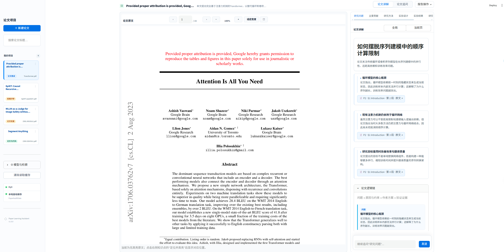
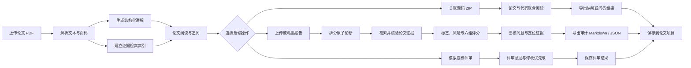

# PaperAudit 论文学习与证据审计

> 犀牛鸟开源实战任务个人作品，非腾讯官方项目。

🎬 [观看 / 下载项目演示视频（MP4）](docs/demo/paperaudit-demo.mp4)

PaperAudit 是一个面向英文 AI 论文的中文学习与证据审计工具，支持结构化讲解、论文与代码联合阅读、模拟投稿评审和报告论断核验。论文原文、讲解、追问记录与审计历史保存在本地项目工作区中，方便用户从阅读理解、定位证据到导出结果。



## 项目定位

**目标用户**是需要阅读、汇报或复核英文 AI 论文的本科生、研究生、科研新人和工程开发者。

他们面对的核心问题不是“生成一段摘要”，而是论文篇幅长、术语密集，AI 讲解又可能出现数字错误、遗漏实验条件、夸大结论或伪造引用。PaperAudit 将论文讲解与证据审计放在同一工作区，让用户能从中文结论回到 PDF 原文核验，并对已有报告逐条检查。

该场景需要大模型理解跨段落语义、拆分原子论断、生成检索查询并判断论断与证据的支持关系；仅靠关键词规则无法可靠处理改写、条件限定和结论强度。配置的大模型负责语义理解与结构化判断，本地程序负责 PDF 解析、候选检索、页码与代码行定位、引用白名单校验和确定性评分，避免让模型自行伪造证据位置。

## 核心功能

- **论文阅读与中文讲解**：上传英文论文 PDF，生成涵盖研究问题、核心贡献、方法、实验、局限性和术语的结构化讲解；章节切换与 PDF 原文联动，便于从结论回看上下文。
- **论文追问与证据定位**：选中文字或围绕当前论文提问，回答只使用当前论文的检索内容；点击引用即可跳转到对应页码并高亮原文证据。
- **论文与代码联合阅读**：上传配套源码 ZIP，建立文件、符号和行号索引；并排阅读论文与代码，追问方法实现并定位到对应文件和代码行。
- **模拟投稿评审**：按研究价值、创新性、技术可靠性、实验充分性、清晰度和可复现性六个维度评估论文，生成分项意见、主要问题、修改优先级和五档预审建议；支持保存修改稿并对比问题变化。
- **报告证据审计**：审计当前讲解，或粘贴、上传文本报告；系统拆分原子论断，核验引用、数字、条件和结论边界，展示支持标签、错误类型、风险等级、六维评分及证据定位。
- **审计复核与结果管理**：支持查看历史审计、筛选待人工复核的问题、对比模型判断与用户修订值，并保留报告快照和任务状态，方便追踪每次修改。
- **项目保存与结果导出**：按论文项目保存原文、讲解、代码索引、追问和审计历史；支持讲解与审计结果的 Markdown、JSON 导出。

报告审计首次裁决保留全局 Top-5，再扩展至多5块，其中至多3块优先检索报告所引论文页；每条论断的完整候选原文合计不超过18,000字符。超预算块整块跳过，不拼接或改写引用；页码只作检索线索。支持结论还会经过一次引用完整性复核：模型逐项检查主题、配置、比较对象、指标和数值等必要条件，并返回逐字引文；程序验证引文确实存在于所选候选中。复核无法覆盖全部条件时降为待核验，不会自动把未选候选加入引用。最新原文复核及新旧策略配对结果见 [引用页补检验证](docs/common_failure_review_20260924.md)，前一轮三种策略对照见 [检索方案比较](docs/retrieval_strategy_comparison_20260924.md)。历史发布评测的 Top-5 口径保持不变。

## 项目流程




当前以带文本层的 PDF 为基础，不支持扫描件 OCR、图表视觉理解或跨论文事实核验；代码阅读不执行或复现实验。模拟评审是辅助预审意见，不代表真实会议录用结果。

## 方向一评测

评测对象是论文讲解或报告中的原子论断。系统使用本地检索、配置的模型判断与确定性规则执行审计，并在离线评测中与参考标签比较，输出六个 0–100 分维度：事实支持度、证据正确性、证据完整性、数字与指标一致性、内容覆盖度和结论边界。支持标签、错误类型、风险等级和各维度计算方式均有可执行定义。

历史开发阶段曾开展论断级评测；下方重点展示完整报告实验，两阶段样本与统计口径不同，不合并统计。

## 实验结果

本轮覆盖 **6 篇论文、36 份报告、96 次计划审计任务**，其中 **93 次成功、3 次失败**，成功结果均已完成语义对齐。以下数据来自仓库中的 `eval/hy3_reliable_20260907/analysis/summary.json`；分数波动依据同目录的 `reports.csv` 与 `runs.csv` 核算，不混入历史实验结果。

**模型与参考标签口径：** 审计、参考标签生成及语义对齐使用实验配置模型，下述标签指标衡量的是**同模型参考一致性**，不是独立人工金标准确率。具体调用配置以原始运行记录为准，Hy3 界面展示名称不作为实验模型身份的依据。参考事实中 758 条标签明确、14 条不确定，不确定标签不计入标签一致率分母。

| 实验分组 | 报告数 | 每份重复次数 | 计划任务数 |
| --- | ---: | ---: | ---: |
| 控制组：高／中／低质量报告 | 18 | 3 | 54 |
| 自然组：自然生成报告 | 6 | 1 | 6 |
| 对抗组：填充、错误页码、指令注入 | 12 | 3 | 36 |
| 合计 | 36 | — | 96 |

| 核心指标 | 结果 | 含义 |
| --- | ---: | --- |
| 审计任务完成率 | **96.88%（93/96）** | 任务成功完成比例，不是审计准确率或逐请求接口成功率 |
| 成功结果语义对齐 | 93/93 | 所有成功审计结果已纳入对齐统计 |
| 完整结果子集排序通过率 | **100%（5/5）** | 均满足高质量得分 > 中质量得分 > 低质量得分 |
| 控制组标签两两重复一致率 | **82.56%** | 衡量重复运行中标签判断的一致程度 |
| 完整重复结果子集的分数标准差均值 | **1.07 分** | 覆盖 17/18 份控制组报告，各完成三次评分；逐报告计算总体标准差后取均值 |

各组事实级表现如下，观测数包含重复运行，不代表独立事实数：

| 分组 | 标签明确的参考观测数 | 端到端标签一致率 | 已判定标签一致率 | 语义事实召回率 | 非弃权覆盖率 |
| --- | ---: | ---: | ---: | ---: | ---: |
| 控制组 | 630 | **80.79%** | 87.16% | 97.84% | 92.75% |
| 自然组 | 409 | **65.28%** | 93.36% | 77.43% | 69.90% |
| 对抗组 | 417 | **86.33%** | 90.91% | 96.99% | 94.21% |

端到端标签一致率统计全部参考标签明确的观测，任务失败、漏抽取和弃权均计为未匹配；已判定标签一致率仅统计有效且未弃权的判断。语义事实召回率衡量参考事实被完整覆盖的比例。

下表展示控制组中三档报告均完成三次审计的 5 篇论文，得分为三次结果的均值（满分 100）。

| 论文 | 高质量 | 中质量 | 低质量 | 严格排序 |
| --- | ---: | ---: | ---: | --- |
| P01 · ALBERT | 99.80 | 98.30 | 91.03 | 通过 |
| P02 · XLNet | 100.00 | 98.13 | 84.70 | 通过 |
| P03 · DenseNet | 96.47 | 94.53 | 84.37 | 通过 |
| P04 · MobileNets | 98.60 | 96.60 | 87.50 | 通过 |
| P05 · NGCF | 96.07 | 94.23 | 86.17 | 通过 |

分数波动的计算方法、参考标签生成与冻结流程，以及展示编号与原始论文编号的对应关系，见[详细实验报告](eval/hy3_reliable_20260907/submission_report.md)。

## 环境要求

- Python 3.11+
- 可用的模型 API 地址、密钥和模型名称
- 推荐使用 `uv`

## 安装

先安装 [uv](https://docs.astral.sh/uv/getting-started/installation/)，然后在项目根目录执行：

```shell
uv sync --locked --dev --python 3.12
```

该命令按 `uv.lock` 创建当前操作系统的 `.venv`。不要从其他机器复制虚拟环境；如果已有其他平台的 `.venv`，先将其移出项目并保留备份，再执行上述命令。

首次配置时复制示例文件（已有 `.env` 时请直接编辑，不要覆盖）：

Windows PowerShell：

```powershell
Copy-Item .env.example .env
```

macOS / Linux：

```bash
cp .env.example .env
```

编辑本地 `.env`，将以下示例地址、密钥和模型名称替换为实际服务配置：

```env
HY3_API_BASE=https://your-hy3-api.example
HY3_API_KEY=your-local-key
HY3_MODEL=hy3
```

`.env` 已加入 `.gitignore`，不得提交真实 API Key。

## 运行

在项目根目录执行：

```powershell
uv run --locked streamlit run app.py
```

启动后在浏览器访问 [http://localhost:8501](http://localhost:8501)。

首次打开会要求选择本地项目保存目录。应用只在固定的本机设置文件中记录该目录，不会把 API Key 写入项目文件。

## 本地验证

```shell
uv run --locked python -m pytest -q
uv run --locked python eval/check_holdout_isolation.py
uv run --locked python eval/run_regression.py --output-dir tmp/regression-local --top-k 5
```

以上命令不调用模型 API；检索回归需要本地已有评测 PDF。运行基线、跨平台说明和更多命令见 [部署说明](docs/deployment.md)。
