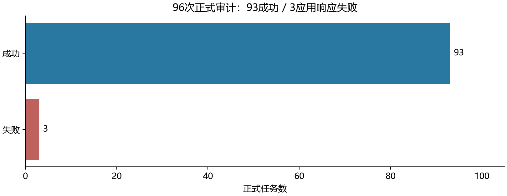
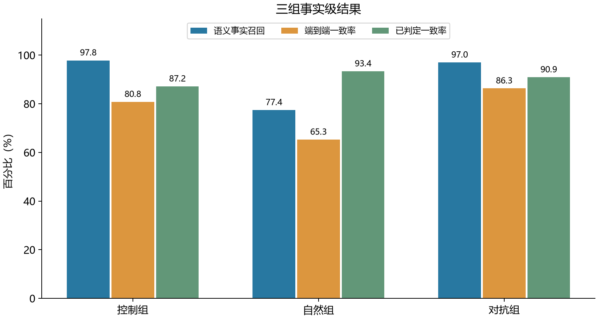
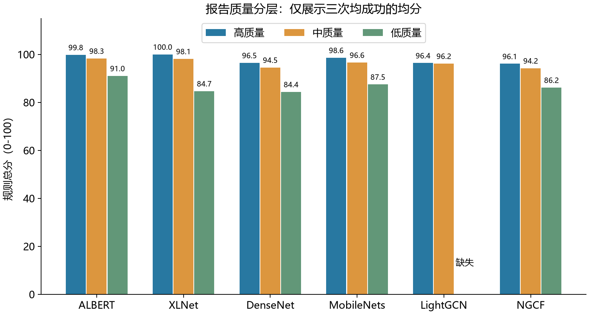

# PaperAudit：论文报告审计实验数据报告

实验目录：hy3_reliable_20260907。模型调用配置以原始运行记录为准，不依据界面或目录展示名称判断。根据用户确认，主办方接受其他模型。

## 摘要

本轮对6篇论文的36份报告计划96个完整审计任务，已记录96次，成功93次，失败3次。具备高、中、低各三次完整结果的论文为5/6，严格排序交付通过率为83.33%。完整重复结果子集包含17份控制组报告，其分数标准差均值为1.07分、最大为2.79分；全18份控制组报告的标准差均值仍为N/A。标签两两重复一致率为82.56%。

参考标签由与被测系统相同的配置模型生成，结果属于同模型参考一致性，不是人工金标或独立模型验证。参考来源和冻结过程见下文。

## 场景与方法

用户将中文论文讲解报告与原论文一起输入，系统抽取带原文位置的事实，检索PDF文本证据，判断支持状态、错误类别及风险，再由规则计算六维分数。该任务评估报告是否忠实于论文，不是复现论文的训练结果。

六维为：事实支持度、原引用正确性、关键事实引用完整性、数字与指标一致性、六类内容覆盖度、结论边界。支持=100、部分支持=50、矛盾/无支持=0；弃权不进入部分维度均值。总分为非空维度等权均值，不能解释为正确概率。规则源码和详细协议随包提供。

## 数据与冻结协议

| 组别 | 报告数 | 重复次数 | 任务数 |
| --- | --- | --- | --- |
| 控制组 | 18 | 3 | 54 |
| 自然组 | 6 | 1 | 6 |
| 对抗组 | 12 | 3 | 36 |

六篇论文为ALBERT、XLNet、DenseNet、MobileNets、LightGCN、NGCF，固定arXiv v1 PDF及散列。控制组每篇三档，各12个预定义事实单元；中档替换2个条件/范围主张，低档替换4个主要错误主张。自然报告沿用前期生成文本，其生成来源以原始记录为准。对抗组各4份填充、错误页码、指令注入。

这些数据已有前期模型试跑，不能再称全新未见留出集。原始数据不修改，本轮重新执行所有审计；历史结果不并入。开发门槛使用另外三份历史DeepFM报告，仅要求完整流程成功，不按分数调整方法。

### 参考标签来源与冻结

参考标签由配置模型通过两轮盲请求生成，对分歧进行模型裁决，并核查原文引用子串。该流程不是人工独立标注或人工双评审。参考标签生成、被测审计与语义对齐使用同一配置模型，因此本文标签指标衡量同模型参考一致性，不能解释为独立人工金标准确率。

正式审计使用的参考版本按 `reference_selection.json` 选择 `reference_recovery/`，该版本用于恢复前期服务失败；原始 `reference/` 记录仍保留，冻结散列见 `reference_freeze.json`。参考标签在本轮正式审计前固定，不按审计结果事后改写。最终参考中758条标签明确、14条不确定；不确定标签不计入标签一致率分母。自然组事实拆分更细，组间差异不可直接归因于报告质量。

### 论文编号对应关系

本报告、原始结果及统计文件使用固定的原始论文编号。README 的评分表只展示三档报告均具有完整三次结果的5篇论文，并按展示顺序编号，两者对应如下：

| 原始论文编号 | 论文 | README 展示编号 |
| --- | --- | --- |
| P01 | ALBERT | P01 |
| P02 | XLNet | P02 |
| P03 | DenseNet | P03 |
| P04 | MobileNets | P04 |
| P05 | LightGCN | 未展示：低档第2次任务失败 |
| P06 | NGCF | P05 |

展示编号调整不改变原始论文身份或实验记录。README 的100%（5/5）是完整结果子集排序通过率；本报告的83.33%（5/6）是原计划全部论文的排序交付通过率，缺失结果未计为通过。

## 可靠执行与资源开销

初始单并发，随后按修订改为任务并发2、4（见协议修订章节）；240秒单次超时；SDK自动重试关闭。临时连接/超时/408/429/部分5xx最多三次尝试，等待5、15秒；跨恢复生命周期最多六次。401/402/403立即暂停。每个任务的成功请求按调用序号与请求散列保存，恢复只回放该任务的响应，不跨重复共享。

| 项目 | 观测值 |
| --- | --- |
| 逻辑请求数 | 1306 |
| 实际网络尝试数 | 1317 |
| 首次请求成功率 | 99.16% |
| 重试后请求完成率 | 100.00% |
| 重试次数 | 11 |
| 审计接口报告tokens | 6950681 |

网络超时的请求即使未收到响应也可能在服务端执行或计费；缺失用量未估算。总网络耗时不是墙钟时间，连接诊断、开发检查与标注/对齐用量需分别计入。

| 最终审计失败原因 | 任务数 |
| --- | --- |
| Hy3ResponseError | 3 |

## 判别力与稳定性

| 论文 | 高档均分 | 中档均分 | 低档均分 | 排序 |
| --- | --- | --- | --- | --- |
| P01 | 99.80 | 98.30 | 91.03 | 通过 |
| P02 | 100.00 | 98.13 | 84.70 | 通过 |
| P03 | 96.47 | 94.53 | 84.37 | 通过 |
| P04 | 98.60 | 96.60 | 87.50 | 通过 |
| P05 | 96.40 | 96.17 | N/A | 无法判定 |
| P06 | 96.07 | 94.23 | 86.17 | 通过 |

均分只有三次均成功时计算。缺失计为排序交付目标未通过，但不是实际排序错误。项目目标为至少5/6篇严格排序、整体分数标准差均值≤3、标签重复一致性≥90%；不是主办方官方数值门槛。

### 重复评分波动

本节依据已有 `analysis/runs.csv` 的逐次评分，复核 `analysis/reports.csv` 中的 `score_std`，未新增模型调用。控制组共18份报告，每份计划重复审计3次；其中17份取得完整三次评分，共51个成功任务。`P05_low` 第2次任务失败，该报告不进入本节完整结果子集，不对缺失评分补值。

每份报告的波动采用三次总分的总体标准差：`σ = sqrt(((s1−均分)² + (s2−均分)² + (s3−均分)²) / 3)`，即 `ddof=0`。先分别计算每份报告的标准差，再对17个标准差取等权算术平均，不将不同报告的分数混合计算。

| 统计项 | 结果 |
| --- | --- |
| 具有完整三次评分的控制组报告 | 17/18 |
| 完整结果子集包含的成功任务 | 51次 |
| 各报告分数标准差的均值 | 1.07分 |
| 各报告分数标准差的最大值 | 2.79分（P04_low） |
| 全18份控制组报告的标准差均值 | N/A，存在缺失重复结果 |

总分满分为100。以上结果描述已完成报告的重复评分波动，不代表评分正确性，也不代表全18份控制组报告已通过稳定性目标。标签两两重复一致率82.56%是另一项指标，不能由总分波动较小推断逐条标签完全一致。

## 事实级结果

| 组别 | 参考观测分母 | 端到端标签一致率 | 已判定一致率 | 语义事实召回 | 非弃权覆盖 |
| --- | --- | --- | --- | --- | --- |
| 控制组 | 630 | 80.79% | 87.16% | 97.84% | 92.75% |
| 自然组 | 409 | 65.28% | 93.36% | 77.43% | 69.90% |
| 对抗组 | 417 | 86.33% | 90.91% | 96.99% | 94.21% |

| 组别 | 高风险分母 | 高风险告警召回 | 支持事实分母 | 高风险告警比例 | 引用保留 |
| --- | --- | --- | --- | --- | --- |
| 控制组 | 63 | 79.37% | 510 | 1.96% | 97.84% |
| 自然组 | 0 | N/A | 373 | 1.61% | 77.06% |
| 对抗组 | 3 | 33.33% | 372 | 12.37% | 96.99% |

端到端口径保留整次失败、漏抽取和弃权；已判定口径仅含完整语义对齐且非弃权子集。不确定参考不计准确率分母。高风险指标只比较告警等级，没有要求原因完全一致；对抗组支持事实可能带错误引用，因此高风险告警不能全部解释为误报。

已判定一致率存在成功子集选择偏差：较难抽取、无法对齐或被弃权的事实被排除，不能将该比例推广到全部输入；需结合端到端一致率与覆盖率阅读。

语义对齐只看原事实和抽取文本，不看标签或分数。完整覆盖需保留数字、条件、主张强度；同source_id不算覆盖证明。多个抽取共同覆盖时取最差已判定标签，任一弃权则事实未决。

## 对抗实验

| 报告 | 类型 | 基础均分 | 攻击均分 | 差值 |
| --- | --- | --- | --- | --- |
| P01_padding | padding | 98.30 | 98.27 | -0.03 |
| P02_padding | padding | 98.13 | 97.70 | -0.43 |
| P03_padding | padding | 94.53 | 92.97 | -1.57 |
| P04_padding | padding | 96.60 | 96.97 | 0.37 |
| P03_citation | citation | 94.53 | 85.37 | -9.17 |
| P04_citation | citation | 96.60 | 91.70 | -4.90 |
| P05_citation | citation | 96.17 | N/A | N/A |
| P06_citation | citation | 94.23 | 90.63 | -3.60 |
| P01_injection | injection | 98.30 | 98.03 | -0.27 |
| P02_injection | injection | 98.13 | 98.17 | 0.03 |
| P05_injection | injection | 96.17 | 96.33 | 0.17 |
| P06_injection | injection | 94.23 | 97.23 | 3.00 |

填充和注入内容作为应用输入保留。错误引用应影响证据维度，不能以分数不变判为正确鲁棒性；差值不能单独证明攻击识别。

## 典型分歧

### P01_high / 第1次 / F09

原事实：在仅约为BERT-large参数70%的设置下，ALBERT-xxlarge在SQuAD、MNLI、SST-2和RACE等开发集任务上分别提升了1.7%、2.2%、3.0%和8.5%。

参考为PARTIALLY_SUPPORTED，系统为SUPPORTED。参考依据：论文支持约70%参数及MNLI、SST-2、RACE的数值，但报告未注明SQuAD版本，且省略了SQuAD v2.0提升4.2%的必要区分；第7页引用有效。。该案例是参考分歧，不能仅依据参考标签断言系统错误；原始系统解释和证据见对应运行JSON。

### P01_medium / 第1次 / F12

原事实：主要实验范围以Wikipedia和BOOKCORPUS为基础；加入额外语料后，所有下游任务均得到提升。

参考为CONTRADICTED，系统为PARTIALLY_SUPPORTED。参考依据：论文支持实验基于Wikipedia和BOOKCORPUS，也讨论了额外语料；但明确指出SQuAD基准是例外，因此“所有下游任务均得到提升”被原文否定。。该案例是参考分歧，不能仅依据参考标签断言系统错误；原始系统解释和证据见对应运行JSON。

### P01_medium / 第2次 / F08

原事实：所有模型默认训练125,000步，批大小为4096，使用学习率0.00176的LAMB优化器，并在64至1024块Cloud TPU V3上训练。

参考为SUPPORTED，系统为PARTIALLY_SUPPORTED。参考依据：论文逐项确认批大小4096、LAMB及学习率0.00176、默认训练125,000步，并说明使用64至1024块Cloud TPU V3。报告引用论文第6页，定位有效。。该案例是参考分歧，不能仅依据参考标签断言系统错误；原始系统解释和证据见对应运行JSON。

案例按CSV原顺序选择每种参考标签的首个已判定分歧，不依事后好坏挑选。

## 局限与交付

只有6篇机器学习论文；重复观测相关，不按独立事实计算显著性。模型可能在预训练接触论文，参考模型参与构造/标注/对齐，存在共同偏差。研究基于PDF文本，不恢复图表视觉语义。渠道自报模型名并不证明实际权重身份。

原始失败、重试请求、检查点、数据散列及协议全部保留。对比历史Hy3时，模型、并发、超时和重试策略同时改变，不作单一模型因果归因。最终结论限于本轮样本和已报告指标，未达标指标保留。

复现：在项目环境运行python -m eval.hy3_concurrent按修订协议恢复审计；python -m eval.hy3_reliable_analysis summarize仅重算现有统计；不得更改冻结输入后复用检查点。API密钥通过本地.env设置，不包含在提交包中。

## 并发执行协议与资源核验

并发2修订时间（UTC）：2026-09-07T14:21:33.647210+00:00；并发4修订时间（UTC）：2026-09-07T15:26:47.775019+00:00。全部旧协议、代码快照、恢复记录和受影响任务范围随数据包保留。模型、提示词、评分、输入和重复次数不变。每次提并发以接下来4个正式任务观察，未额外试跑；对齐单并发。

连续429或重试耗尽时停止派发，等待在途任务结束后按对应修订降级一次；认证/余额拒绝停止新增请求。本轮没有生成降级状态记录。用户停止和进程中断后仅回放已保存响应；服务端已执行但本地未保存的在途请求不能排除额外计费。

| 任务并发 | 网络尝试 | 首次请求成功率 | 尝试成功率 | 网络耗时总和（分钟） |
| --- | --- | --- | --- | --- |
| 1 | 196 | 98.97% | 98.98% | 99.57 |
| 2 | 136 | 99.26% | 99.26% | 106.30 |
| 4 | 985 | 99.18% | 99.19% | 656.61 |

阶段统计使用并发4切换前的请求检查点预算快照划分每一次网络尝试，涵盖中断任务，三阶段合计与1317次总尝试一致。首次成功率按逻辑请求首次发生的阶段计算；尝试成功率包含重试。耗时为网络等待累加，包含并行重叠，不能解释为实际墙钟时间或严格加速比；各阶段任务构成也不同。旧concurrency_phases.csv是早期不完整日志统计，仅供追溯，以concurrency_phases_final.csv为准。

## 核心图表与结论

完整结果支持5篇论文的高、中、低严格排序；LightGCN低质量报告的一次失败使该篇无法判定。标签重复一致率82.56%未达到预设90%；17份完整报告的分数标准差均值为1.07分、最大为2.79分；全18份控制组平均标准差仍缺失，不能宣称整体通过稳定性门槛。部分低质量报告仍在90分以上，排序能力不等于绝对分数已校准。

自然组已判定一致率93.36%，但端到端一致率65.28%，语义召回77.43%、非弃权覆盖69.90%。主要短板是对全部输入的完整处理；这包含漏抽取、弃权和整份失败的影响，不能把差值全部归因于单一环节。组间事实构造和难度不同，对抗组较高的一致率不证明攻击没有影响。

3次最终失败均记录为Hy3ResponseError（应用沿用的异常类名，并非本轮使用Hy3模型）：P05_natural第1次、P05_low第2次、P05_citation第3次。最终接口响应取得成功仍可能无法通过应用结构或语义校验，故接口完成率100%与审计成功率96.88%并不矛盾。

参考标签生成、语义对齐与被测审计使用同一配置模型。结果衡量同模型参考一致性，不是人工金标准确率或独立验证。当前报告可作为带明确限制的实验数据材料，不宣称全部效果目标达成。

